<div align="center">


# StudyMate AI

**An AI-powered study assistant for college students**

Ask questions subject-wise, chat with your own PDF notes, take AI-generated quizzes and get personalised revision suggestions, powered by Google Gemini.


*BCA Project · Parul University · Ajitabh Kumar Jha*

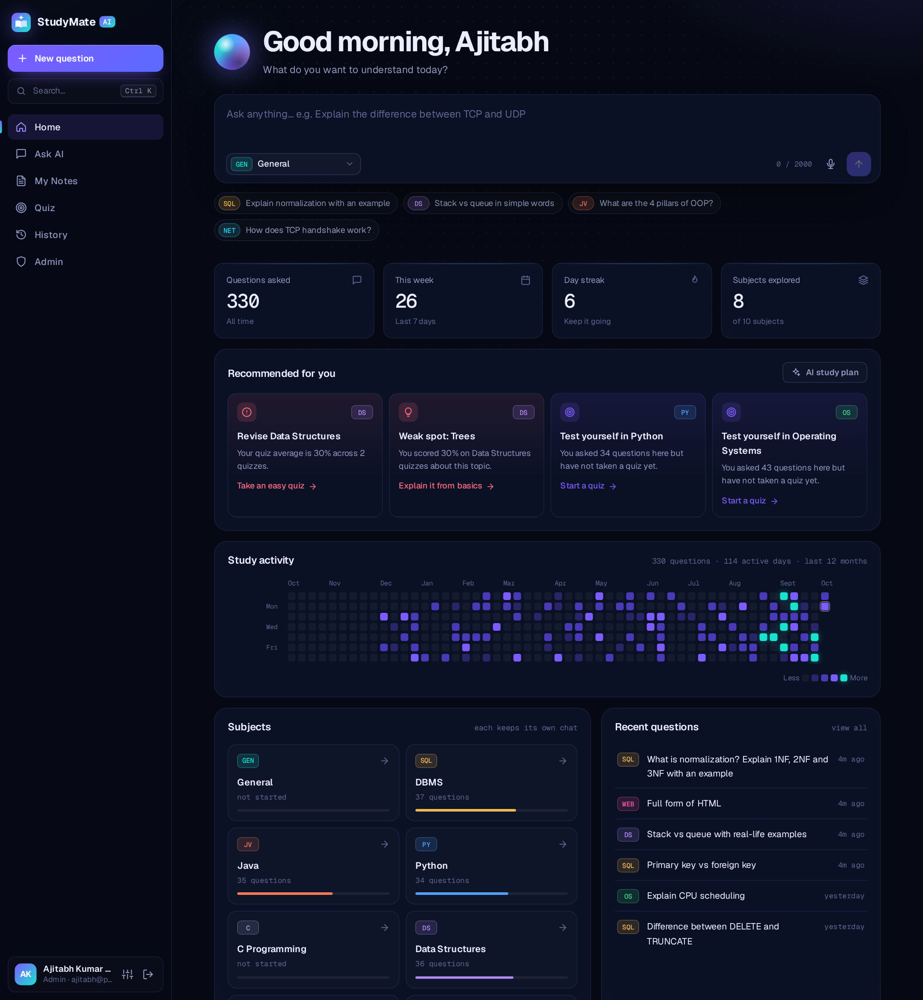

</div>

---

## Contents
[About](#about-the-project) · [Features](#features) · [Screenshots](#screenshots) · [Tech stack](#tech-stack) · [Architecture](#system-architecture) · [Database](#database-design) · [Getting started](#getting-started) · [API](#api-overview) · [Security](#security-highlights)

## About the project

Students spend a lot of time searching for answers across many websites, and the information is often scattered or hard to understand. **StudyMate AI** gives them one place to ask academic questions in plain language and get clear, step-by-step answers, with every conversation saved by subject for quick revision.

**Objectives**
- Give instant, easy-to-understand answers to academic questions.
- Make learning interactive through chat, quizzes and voice.
- Reduce the time spent searching across scattered sources.
- Support self-learning and revision with history, insights and study plans.

## Features

| Feature | What it does |
|---|---|
| 💬 **Subject-wise AI chat** | 10 subjects (DBMS, Java, Python, OS, CN, DS and more), each with its own conversation. The AI remembers the last 4 messages, so follow-up questions work naturally. |
| 📄 **Chat with your notes** | Upload a PDF (up to 10 MB) and ask questions from it. Answers come from the PDF, with page references where possible. |
| 🎯 **AI quizzes** | 5 or 10 MCQs on any subject or topic at easy, medium or hard level. Answers are graded on the server, followed by a full review with explanations. |
| 💡 **Smart revision suggestions** | Recommendations from quiz scores and activity (weak subjects, weak topics, subjects not revised recently), plus an AI-generated 3-day study plan. |
| 📊 **Dashboard** | Stats, day streak, a GitHub-style yearly activity heatmap and subject progress bars. |
| 🕘 **History** | Grouped by date, searchable with highlighted matches, filterable by subject and exportable as Markdown. |
| 🎙️ **Voice** | Speak your question (speech-to-text) and listen to answers (text-to-speech). |
| 🌐 **Answer language** | English, Hinglish or Hindi, applied to chat, PDF answers and study plans. |
| 🛡️ **Admin panel** | Usage stats, a 30-day questions chart, subject popularity, quiz performance, and user management. |
| ⌨️ **Developer-style UX** | `Ctrl + K` command palette, keyboard shortcuts, streaming answers, code blocks with copy buttons, fully responsive. |

## Screenshots

| Login | Subject-wise AI chat |
|:---:|:---:|
| 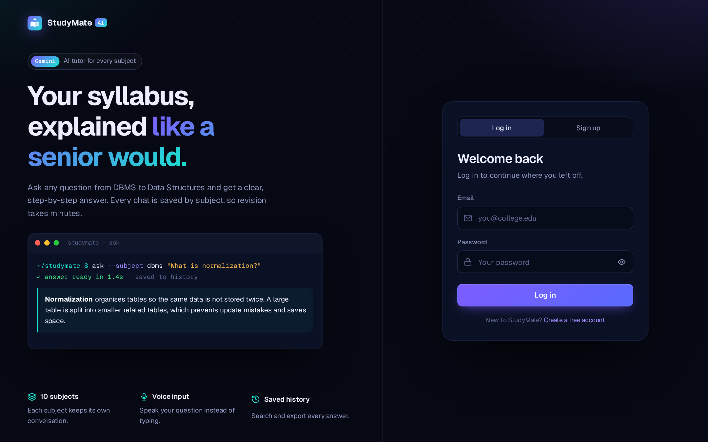 | 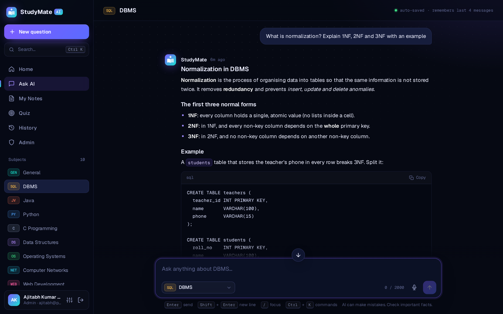 |
| **Quiz in progress** | **Quiz result and review** |
| 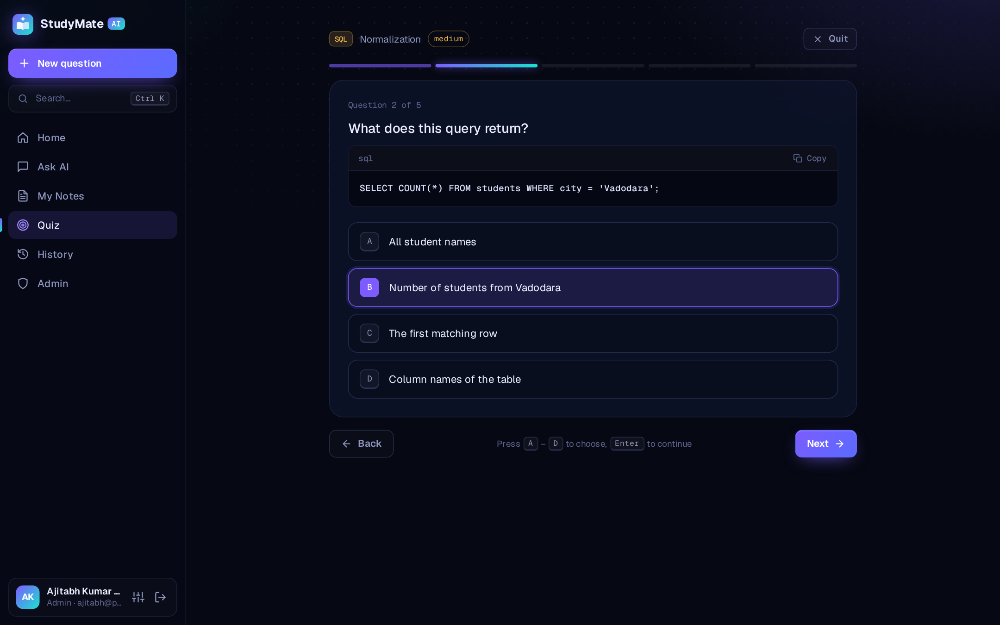 | 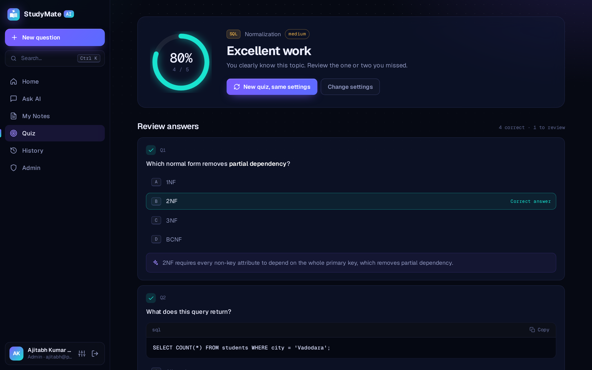 |
| **My Notes (chat with a PDF)** | **History** |
| 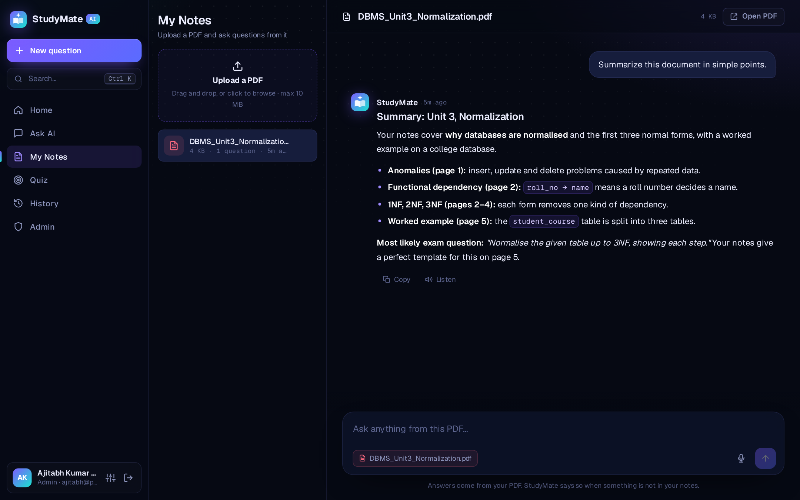 | 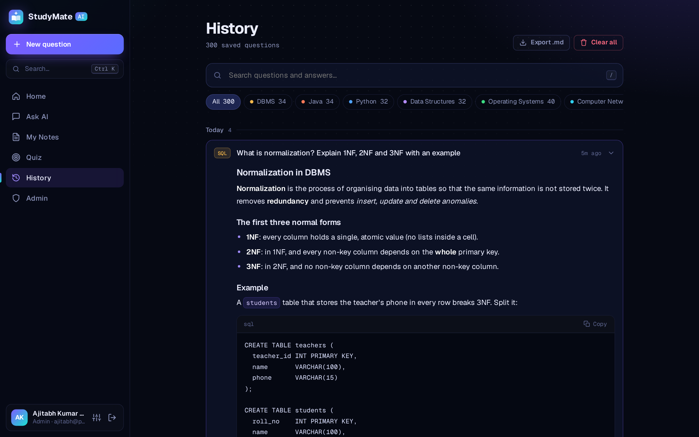 |
| **Admin panel** | **Command palette (Ctrl + K)** |
| 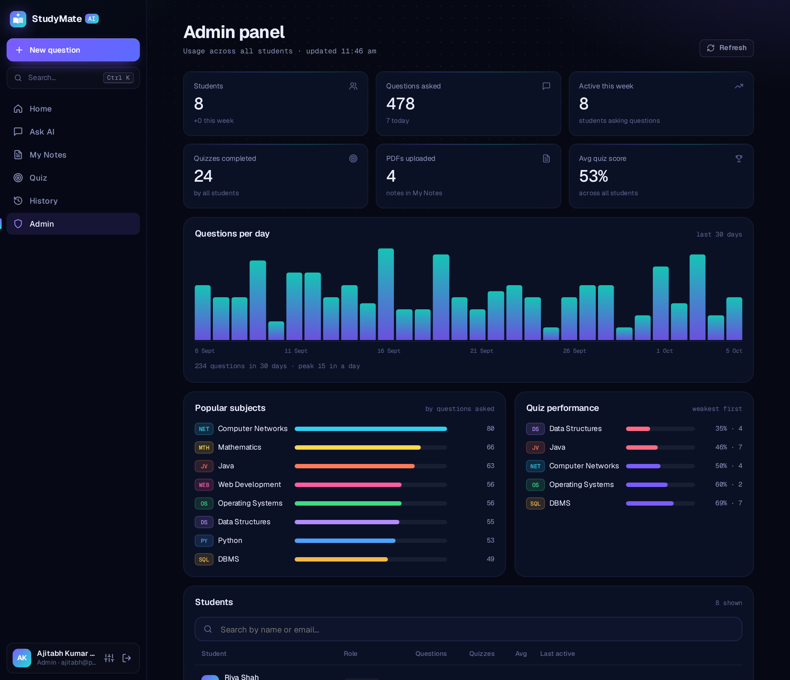 | 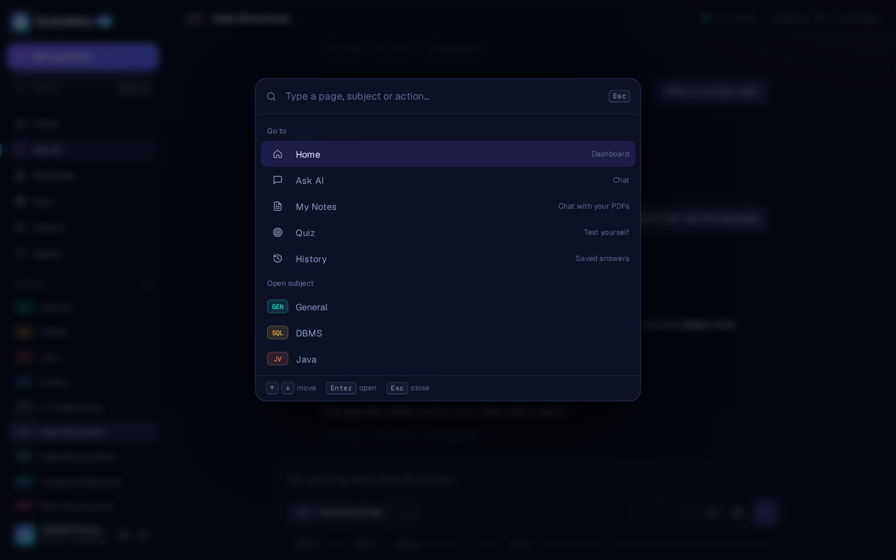 |

<div align="center">
<b>Fully responsive on mobile</b><br><br>
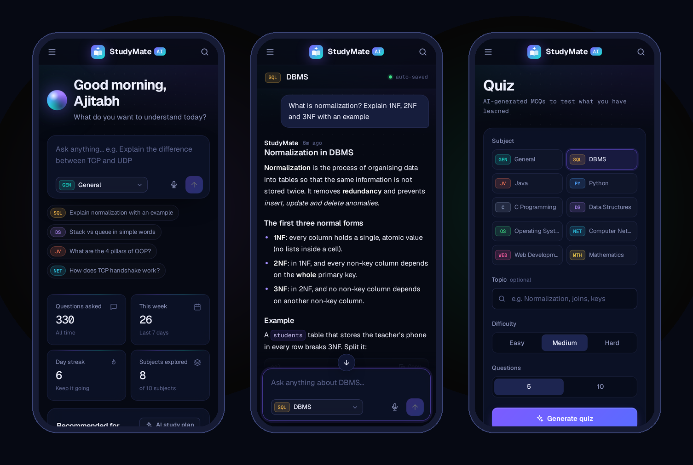
</div>

## Tech stack

| Layer | Technology |
|---|---|
| Frontend | HTML5, CSS3, vanilla JavaScript |
| Backend | Node.js, Express.js |
| Database | MySQL 8.4 |
| AI | Google Gemini API via `@google/genai` |
| Security | bcrypt, JWT, DOMPurify, role-based access control |
| Libraries | marked (Markdown rendering), DOMPurify, Web Speech API |
| Tools | VS Code, Git, GitHub |

## System architecture

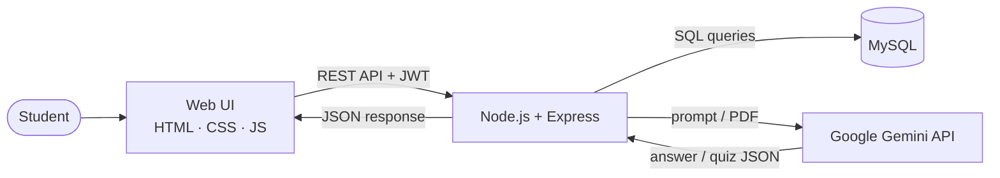

**Request flow:** the student types a question → the frontend sends it to the backend with a login token → the backend checks the token, adds context (subject, last 4 messages, preferred language) and calls Gemini → the answer is saved in MySQL and returned to the browser, which renders it as formatted Markdown.

The Gemini API key lives only on the server. The browser never sees it. If the main model is busy, the backend retries automatically and then switches to a backup model.

## Database design

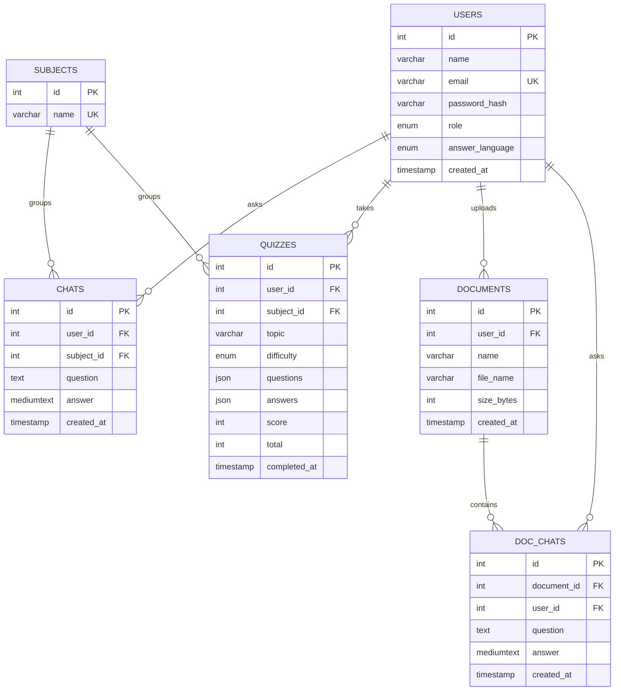

Deleting a user cascades to their chats, quizzes and documents (`ON DELETE CASCADE`), and their uploaded PDF files are removed from disk.

## Getting started

### Prerequisites
- [Node.js](https://nodejs.org) 18 or later
- [MySQL](https://dev.mysql.com/downloads/mysql/) 8.x
- A free [Gemini API key](https://aistudio.google.com)

### 1. Clone and install
```bash
git clone https://github.com/Ajitabhjha13/studymate-ai.git
cd studymate-ai/backend
npm install
```

### 2. Create the database
Log in with `mysql -u root -p` and run the three SQL files **in this order**:
```sql
source path/to/studymate-ai/database/schema.sql;
source path/to/studymate-ai/database/quiz.sql;
source path/to/studymate-ai/database/features.sql;
```

### 3. Configure environment variables
Copy `backend/.env.example` to `backend/.env`, then add your MySQL password, a long random JWT secret and your Gemini API key.

### 4. Run
```bash
node server.js
```
Open **http://localhost:5000**, create an account and start asking.

### 5. Create an admin (optional)
Register an account, then run:
```sql
UPDATE ai_qa_app.users SET role = 'admin' WHERE email = 'your@email.com';
```
Admins can also promote other users from the admin panel.

### Keyboard shortcuts

| Shortcut | Action |
|---|---|
| `Ctrl` + `K` | Open the command palette |
| `/` | Focus the question box or search |
| `Enter` / `Shift` + `Enter` | Send / new line |
| `A`–`D` or `1`–`4` | Choose a quiz option |
| `Esc` | Close the palette or mobile menu |

## Project structure

```
studymate-ai/
├── backend/
│   ├── server.js            # Express app and route setup
│   ├── db.js                # MySQL connection pool
│   ├── gemini.js            # Gemini helper with retry and backup model
│   ├── helpers.js           # Tokens, language rules, file cleanup
│   ├── middleware/
│   │   ├── auth.js          # Verifies the JWT on private routes
│   │   └── admin.js         # Checks the admin role in the database
│   └── routes/              # auth, ask, history, quiz, docs, insights, profile, admin, subjects
├── frontend/
│   ├── *.html               # login, register, dashboard, chat, docs, quiz, history, settings, admin
│   ├── css/style.css        # Design system
│   └── js/                  # One script per page + shared api, shell, icons, voice
├── database/
│   ├── schema.sql           # users, subjects, chats
│   ├── quiz.sql             # quizzes
│   └── features.sql         # roles, language, documents, doc_chats
└── docs/screenshots/
```

## API overview

| Method | Endpoint | Description |
|---|---|---|
| `POST` | `/api/auth/register`, `/api/auth/login` | Create an account, log in |
| `GET` | `/api/auth/me` | Current user (role, language) |
| `POST` | `/api/ask` | Ask a subject question |
| `GET` `DELETE` | `/api/history`, `/api/history/:id` | View and delete history |
| `GET` | `/api/history/stats` | Counts for the dashboard and heatmap |
| `POST` | `/api/quiz/generate`, `/api/quiz/:id/submit` | Create and submit a quiz |
| `GET` | `/api/quiz`, `/api/quiz/:id` | Past attempts, review or resume |
| `GET` `POST` `DELETE` | `/api/docs`, `/api/docs/:id/ask` | Upload PDFs and ask from them |
| `GET` `POST` | `/api/insights`, `/api/insights/plan` | Recommendations and AI study plan |
| `GET` `PUT` `DELETE` | `/api/profile`, `/api/profile/password` | Profile, language, password, account |
| `GET` `PATCH` `DELETE` | `/api/admin/overview`, `/api/admin/users/:id` | Admin stats and user management |

Every endpoint except register and login requires an `Authorization: Bearer <token>` header.

## Security highlights

- Passwords are hashed with **bcrypt** and never stored in plain text.
- **JWT** tokens protect every private API route.
- The **Gemini API key stays on the server**; the frontend only talks to our own backend.
- Admin access is checked against the **database on every request**, not just hidden in the UI.
- Quiz answers are **graded on the server**, so correct answers never reach the browser before submission. Options are shuffled on the server too.
- Uploaded files are verified as real PDFs by their file signature (`%PDF-`), and each user can only access their own files.
- AI output is sanitised with **DOMPurify** before it is displayed, preventing XSS.
- All SQL queries use **parameterised statements**, preventing SQL injection.

## Future scope

- Android and iOS app
- Flashcards generated from saved answers
- Teacher accounts that assign quizzes to a class
- Image-based questions (a photo of a textbook problem)

## Author

**Ajitabh Kumar Jha** · BCA, Parul University
GitHub: [@Ajitabhjha13](https://github.com/Ajitabhjha13)

---
<sub>Built as an academic project. AI answers can contain mistakes; verify important facts with your textbook.</sub>
